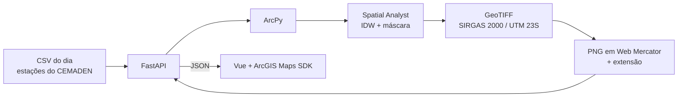

# Rainfall IDW Web GIS — chuva interpolada no RJ

Aplicação Web GIS que gera e mostra superfícies de chuva a partir dos
pluviômetros do CEMADEN no estado do Rio de Janeiro, para qualquer dia de
**1º de janeiro a 31 de agosto de 2026**.

O backend usa **Python, ArcPy e ArcGIS Spatial Analyst** para interpolar por
IDW (*Inverse Distance Weighted*), e expõe o processamento numa API REST com
**FastAPI**. O front-end usa **Vue 3** e **ArcGIS Maps SDK for JavaScript**
para escolher o dia e os parâmetros e visualizar o resultado.

**Site:** https://pimentel-andre.github.io/arcgis-rainfall-idw/

- **mapa** da superfície IDW do dia, com as estações e o limite do estado;
- **parâmetros** configuráveis: potência, resolução e número de vizinhos;
- **validação cruzada** *leave-one-out*: RMSE, MAE e viés, e o erro de cada
  estação no popup e na tabela;
- **estatísticas** da chuva medida e da superfície, e o **GeoTIFF** para
  baixar;
- camadas liga/desliga, opacidade da superfície e tabela de estações que leva
  o mapa até a escolhida.

> Projeto pessoal de portfólio. Os dados vêm do arquivo fechado do
> [monitor-chuva-rj](https://github.com/Pimentel-Andre/monitor-chuva-rj),
> montado com um cadastro individual no PED/CEMADEN.

## Arquitetura



O Vue não sabe como o IDW funciona: manda o dia e os parâmetros para
`POST /api/interpolations/idw` e recebe estatísticas, validação e o endereço
da imagem. O ArcPy não sabe que existe um site: recebe um CSV e devolve um
raster.

**Dois modos, a mesma interface.** O GitHub Pages só serve arquivos — não
roda Python, muito menos ArcPy. Por isso `backend/scripts/gerar_demo.py`
processa os 243 dias e grava cada resposta da API como arquivo em
`frontend/public/demo/`. Sem API local, o front-end lê esses arquivos com o
mesmo código que usa para falar com a API; com ela no ar, processa ao pedido,
com qualquer parâmetro.

## Como rodar

**Requisitos:** ArcGIS Pro 3.x com a extensão Spatial Analyst e licença ativa
(ver [Licença do ArcGIS Pro](#licença-do-arcgis-pro)), e Node 20.19+ ou 22+.

```powershell
# 1. Ambiente Python: um CLONE do ambiente do ArcGIS Pro. O arcgispro-py3
#    original é protegido, e é nele que o arcpy mora.
& "C:\Program Files\ArcGIS\Pro\bin\Python\Scripts\conda.exe" create --clone arcgispro-py3 --name arcgis-idw --pinned
$py = "$env:LOCALAPPDATA\ESRI\conda\envs\arcgis-idw\python.exe"
& $py -m pip install -r backend\requirements.txt

# 2. API (em backend\) -> documentação interativa em http://127.0.0.1:8000/docs
cd backend
& $py -m uvicorn app.main:app --reload

# 3. Mapa (em frontend\, noutro terminal) -> http://localhost:5173
cd frontend
npm install
npm run dev
```

O clone também pode ser feito pela interface do ArcGIS Pro: **Configurações →
Gerenciador de Pacotes → Ambientes → Clonar**.

Em desenvolvimento o Vite repassa `/api` e `/outputs` para o FastAPI, então
o navegador vê tudo na mesma origem e o backend dispensa CORS.

**Testes:** `python -m pytest` dentro de `backend/` e `npm test` dentro de
`frontend/`. Os testes que precisam do ArcPy se pulam sozinhos quando ele não
está disponível — é o caso do GitHub Actions, que roda o resto a cada push e
só publica o site se tudo passar.

**Scripts** (em `backend/scripts/`, no ambiente do ArcGIS):

| script | o que faz |
|---|---|
| `preparar_dados.py` | baixa a série do monitor-chuva-rj e o limite do IBGE, e grava `data/` |
| `rodar_idw.py` | roda o IDW de um dia direto no terminal, sem API — a V0.1 do projeto |
| `gerar_demo.py` | processa os 243 dias e congela as respostas para o site estático |

O mapa usa o OpenStreetMap em tons de cinza como base. Com uma API key
gratuita de [developers.arcgis.com](https://developers.arcgis.com) em
`frontend/.env.local` (modelo em `.env.local.example`), passa a usar o cinza
claro da Esri. O ArcGIS Maps SDK for JavaScript não usa license string — isso
é dos SDKs nativos.

## Licença do ArcGIS Pro

Com licença de usuário nomeado (a de conta institucional, por exemplo), o
ArcPy só inicializa com o ArcGIS Pro autenticado. Sem isso o import falha com
`RuntimeError: A licença do produto não foi inicializada` — a API sobe do
mesmo jeito, `/api/health` diz o motivo e o IDW responde 503.

1. Abra o ArcGIS Pro e entre com a sua conta.
2. Marque **Iniciar sessão automaticamente**.
3. Para o ArcPy funcionar com o Pro fechado: **Configurações → Licenciamento →
   Autorizar o ArcGIS Pro a trabalhar offline** (se a organização permitir).
4. Reinicie a API.

## Dados

| arquivo | conteúdo |
|---|---|
| `data/stations.csv` | 187 estações: código, nome, município, coordenadas |
| `data/precipitation_daily.csv` | 37.691 leituras: chuva de 24 h por estação e dia |
| `data/study_area.geojson` | limite do estado, IBGE (qualidade máxima, com as ilhas) |

A chuva de cada dia é o acumulado da janela de 24 h em UTC, a mesma do
monitor-chuva-rj. Para rodar o IDW de um dia, o backend junta as duas tabelas
num CSV no formato `station_id, name, longitude, latitude, precip_mm` e o
grava na pasta da rodada, ao lado do GeoTIFF: fica registrado exatamente o
que entrou no processamento.

Duas regras de qualidade vêm do monitor-chuva-rj:

- **dia sem leitura não vira linha.** "Não mediu" não é "não choveu": um zero
  ali cavaria um falso buraco seco na superfície;
- **pluviômetro travado fica de fora.** Seis sensores registram quase nada em
  oito meses — dois em Petrópolis — e mediriam 0 mm onde choveu.

## Parâmetros e API

| parâmetro | padrão | limites | efeito |
|---|---|---|---|
| `date` | 2026-01-20 | 2026-01-01 a 2026-08-31 | o dia da chuva |
| `power` | 2 | 0 < p ≤ 6 | quanto a estação próxima pesa mais que a distante |
| `cell_size` | 1000 m | 250 a 5000 m | a resolução do raster |
| `neighbors` | 12 | 3 a 50 | estações usadas em cada célula (raio variável) |

Os valores são pontos de partida, não verdades: potência maior deixa a
superfície mais "puxada" por cada estação; mais vizinhos a suavizam.

| rota | resposta |
|---|---|
| `GET /api/health` | ArcPy e Spatial Analyst disponíveis? |
| `GET /api/dates` | os dias do arquivo, com média e máximo de cada um |
| `GET /api/stations?date=` | as estações com leitura no dia, e as classes da legenda |
| `GET /api/study-area` | o limite do estado, em GeoJSON |
| `POST /api/interpolations/idw` | roda o IDW; devolve estatísticas, validação e a imagem |
| `GET /outputs/<rodada>/...` | o GeoTIFF, o PNG, o CSV de entrada e o JSON de cada rodada |

```json
{ "date": "2026-01-20", "power": 2, "cell_size": 1000, "neighbors": 12 }
```

## O processamento com ArcPy

Uma função por etapa, na ordem em que se faria à mão no ArcGIS Pro
(`backend/app/services/idw_service.py`):

1. `XYTableToPoint` — longitude e latitude do CSV viram pontos (WGS 84);
2. `Project` — para **SIRGAS 2000 / UTM 23S** (EPSG:31983), em metros;
3. `Idw` com `RadiusVariable(vizinhos)` — sobre o retângulo do estado,
   alinhado a múltiplos da célula;
4. `ExtractByMask` — apaga o que cai fora do polígono do estado;
5. GeoTIFF float32, com estatísticas gravadas junto;
6. `ProjectRaster` para Web Mercator → PNG classificado, para o mapa.

## Validação

*Leave-one-out*: cada estação sai da conta, o IDW estima a chuva no lugar
dela com as demais, e a estimativa é comparada com o que ela mediu. Repetido
para todas:

| | 20/01/2026, parâmetros padrão |
|---|---|
| RMSE | 37,9 mm |
| MAE | 26,3 mm |
| Viés | +0,8 mm |

O erro é grande porque a chuva de verão no RJ é convectiva: tempestades de
poucos quilômetros entre estações que distam mais que isso. E o IDW nunca
passa do maior valor medido ao redor, então os picos são os mais
subestimados — Independência 2, em Petrópolis, mediu 182,8 mm, e sem ela o
IDW estimaria 72,5 mm ali. É esse tipo de leitura que a validação existe
para mostrar.

## Decisões técnicas

**SIRGAS 2000 / UTM 23S, com a transformação de datum explícita.** O IDW
pondera por distância e não pode rodar em graus. A zona 23 cobre de 48°W a
42°W; o RJ vai até 40,9°W, e na faixa leste a escala erra cerca de 0,2% —
pouco para um método que usa distâncias relativas. Os pontos chegam em
WGS 84, e a transformação `SIRGAS_2000_To_WGS_1984_1`, de parâmetros nulos,
fica escrita em vez de deixada para o ArcGIS escolher.

**Máscara por `ExtractByMask`, e não por `arcpy.env.mask`.** Pelo ambiente o
resultado era o mesmo — 43.742 células de 1 km², a área do estado —, mas o
`Idw` imprimia "Mask is ignored" a cada rodada.

**De 45 s para ~5 s por rodada, medindo etapa por etapa.** 25 s eram do
`CalculateStatistics`; as estatísticas agora saem na gravação
(`rasterStatistics`). O `ProjectRaster` custa ~3 s, quase tudo custo fixo da
ferramenta. A função raster `arcpy.ia.Reproject` faz o mesmo em 0,1 s, mas
exige Image Analyst, e o projeto pede só o Spatial Analyst. A primeira rodada
de um processo leva mais (~17 s): é o ArcPy carregando as ferramentas.

**A validação é em NumPy, e um teste prova que é a mesma conta.** Com ArcPy
seria um IDW inteiro por estação — 143 rodadas. `test_arcpy_consistency`
sorteia 300 células do raster do ArcPy e recalcula cada uma em NumPy: batem a
menos de 0,01 mm, em três dias e três combinações de parâmetros.

**Um IDW por vez.** O ArcPy guarda estado global e não é seguro entre
threads, e o FastAPI atende requisições em paralelo. O processamento roda sob
um lock, numa rota `def` (e não `async def`), para não travar o servidor.

**A imagem chega em Web Mercator.** A `MediaLayer` só estica a imagem entre os
cantos da extensão. Uma grade UTM vista em Web Mercator não é um retângulo
esticado — as linhas giram de leve de oeste para leste —, então um PNG em UTM
sairia deslocado nas bordas. O ArcPy reprojeta antes, e a imagem já chega no
sistema do basemap.

**Uma lista de classes para tudo.** As sete classes (0–10, 10–20, 20–30,
30–40, 40–60, 60–80, > 80 mm) pintam o PNG no backend e chegam na resposta
da API para pintar as estações e a legenda — não há como discordarem. Os
limites são fechados à direita, como no renderer do ArcGIS: 10 mm exatos caem
em "0–10" tanto no pixel quanto no ponto. A rampa é sequencial, de um só
matiz, em passos iguais de luminosidade: chuva é magnitude, e arco-íris
pareceria bonito e atrapalharia a leitura.

**O ponto tem a cor da superfície embaixo dele.** O IDW é exato: passa pelo
valor medido. Um `drop-shadow` na camada de estações é o que as separa da
superfície.

**O resultado de um dia não se mistura com as estações de outro.** Trocar de
dia leva alguns segundos com o ArcPy; nesse meio-tempo a superfície e a
validação anteriores saem da tela em vez de ficarem sob as estações novas.

**A camada de estações troca as feições de uma vez.** Nem toda estação mede
todo dia, então a camada troca o conjunto inteiro com `applyEdits`, numa
fila, e acha a estação pelo código — não pela posição na lista.

## Limitações

- O IDW não conhece o relevo. No RJ a Serra do Mar decide muito da chuva, e
  uma estação do outro lado da serra pesa igual à do mesmo lado.
- Longe das estações (o noroeste do estado, o mar) a superfície é
  extrapolação: repete as estações mais próximas.
- O "olho-de-boi" em volta das estações isoladas é característico do método,
  mais forte com potências altas.
- As classes são ilustrativas, pensadas para chuva de 24 h.
- No site estático os parâmetros ficam fixos; variá-los exige a API local.

## Próximos passos

- Novos meses, quando o arquivo do monitor-chuva-rj crescer: `preparar_dados.py`
  e `gerar_demo.py`, nessa ordem.
- Comparar com krigagem (Geostatistical Analyst) e com IDW com barreiras.
- Publicar o raster como serviço de imagem e consumi-lo como
  `ImageryTileLayer`, com consulta ao valor do pixel no clique.
- Interface com o Calcite Design System.

## Estrutura

```
backend/
  app/main.py                  FastAPI: rotas e arquivos de saída
  app/api/interpolation.py     rotas REST
  app/schemas/interpolation.py contratos da API (Pydantic)
  app/services/idw_service.py  pipeline ArcPy
  app/services/validation.py   leave-one-out em NumPy
  app/services/symbology.py    classes, cores e o PNG
  app/services/stations.py     leitura dos CSVs e o recorte do dia
  scripts/                     preparar dados, rodar no terminal, gerar o demo
  tests/                       pytest
frontend/
  src/components/              MapView, InterpolationForm, DaySelector,
                               StationTable, MapLegend, StatisticsPanel
  src/composables/             useInterpolation: o estado da tela
  src/services/idwApi.js       os dois modos: API e demo
  public/demo/                 respostas da API congeladas (site estático)
data/                          estações, chuva diária e área de estudo
outputs/                       rodadas da API (não versionado)
```

## Autor

Andre Anjos — [github.com/Pimentel-Andre](https://github.com/Pimentel-Andre)
